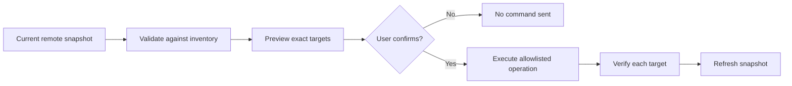

<h1 align="center">Remote firewalld Manager</h1>

<p align="center">
  A focused desktop GUI for safely managing <code>firewalld</code> on remote Linux servers over SSH.
</p>

<p align="center">
  
  
  
  
</p>

<p align="center">
  Inspect runtime and permanent state, preview exact changes, verify every result,
  and keep each server session isolated.
</p>

> [!IMPORTANT]
> This application changes remote firewall rules. Test with a disposable host or
> ensure you have independent console access before modifying SSH-related rules,
> moving active interfaces, or reloading firewalld.

## Why use it?

| Clear remote state | Guarded changes | Portable by design |
| --- | --- | --- |
| See zones, ports, services, interfaces, rich rules, firewalld status, and sanitized logs in one place. | Every mutation is inventory-backed, explicitly confirmed, executed through an allowlist, verified, and followed by a refresh. | Configuration, trusted host keys, and logs stay beside the executing `main.py`—ideal for a self-contained Windows folder. |

Remote firewalld Manager is developed and tested primarily on **Windows**. Its
Python and Qt code can also run on Linux and macOS. The remote target must be a
Linux server reachable over SSH. The supported target is firewalld 2.x;
selected legacy output formats are accepted for compatibility but do not imply
complete support for older firewalld releases.

## Features

| Area | Capabilities |
| --- | --- |
| **Overview** | Connection state, remote hostname and distribution, firewalld version, default zone, active runtime zones, assigned interfaces, and snapshot freshness. |
| **Ports** | Search and filter ports by zone and runtime/permanent presence; add or remove exact TCP/UDP ports and ranges. |
| **Services** | Compare runtime and permanent service membership; add or remove services from the server-reported inventory. |
| **Zones** | Inspect runtime or permanent zone details, identify runtime-active zones, and change the default zone. |
| **Interfaces** | Review runtime/permanent assignments and move interfaces between zones with lockout warnings. |
| **Rich rules** | Inspect structured rich rules and create or remove validated, supported rule forms without a free-form command field. |
| **Reload and logs** | Confirm firewalld reloads and review per-server, sanitized application events. |
| **Multiple servers** | Maintain isolated profiles and sessions; selecting a server never connects automatically. |

## Quick start

### Windows (primary tested platform)

Requirements:

- Python **3.11 or newer**
- Git, or a downloaded copy of this repository
- An SSH-accessible Linux server running firewalld

```powershell
git clone https://github.com/Steven-w65/firewalld-remote-gui.git
Set-Location firewalld-remote-gui

py -3.11 -m venv .venv
.\.venv\Scripts\python.exe -m pip install --upgrade pip
.\.venv\Scripts\python.exe -m pip install -r requirements.txt

Copy-Item config.example.yaml config.yaml
notepad config.yaml

.\.venv\Scripts\python.exe main.py
```

Using the virtual environment's Python directly avoids PowerShell activation-policy
issues. If `py` is unavailable, replace the first command with the path to a
Python 3.11+ interpreter.

> [!NOTE]
> `config.yaml` is not generated automatically. Copy
> [`config.example.yaml`](config.example.yaml), rename the copy to `config.yaml`,
> and keep it in the same directory as `main.py`.

### Linux and macOS

```bash
git clone https://github.com/Steven-w65/firewalld-remote-gui.git
cd firewalld-remote-gui

python3 -m venv .venv
.venv/bin/python -m pip install --upgrade pip
.venv/bin/python -m pip install -r requirements.txt

cp config.example.yaml config.yaml
$EDITOR config.yaml

.venv/bin/python main.py
```

The application does not install, start, or reconfigure SSH or firewalld on the
remote host. Prepare those services through your normal administration process.

## Configuration

Start with [`config.example.yaml`](config.example.yaml) and replace its
documentation-only server addresses and credentials:

```yaml
application:
  ssh_timeout: 10.0
  command_timeout: 20.0
  confirm_changes: true
  strict_host_key_checking: true

servers:
  - id: web01
    name: Production web server
    host: 203.0.113.10
    port: 22
    username: firewall-operator
    password: "replace-with-the-ssh-password"
    sudo: true
```

> [!CAUTION]
> The SSH password is stored locally as plaintext in `config.yaml`. Restrict
> access to the portable application folder, use a dedicated least-privilege
> account, and never commit or share `config.yaml`.

Only the **SSH login password** may be persisted. A sudo password is never a
configuration field and is never written to disk. When required, it is entered
through a masked dialog and retained only in the selected server's live memory
until disconnect, session replacement, or authentication failure.

<details>
<summary><strong>Configuration field reference</strong></summary>

### `application`

| Field | Type / default | Purpose |
| --- | --- | --- |
| `ssh_timeout` | positive number / `10.0` | Default SSH connection, authentication, and banner timeout in seconds. |
| `command_timeout` | positive number / `20.0` | Default timeout for an approved remote operation. |
| `confirm_changes` | boolean / `true` | Schema compatibility setting. Every mutation still requires confirmation; keep this `true`. |
| `strict_host_key_checking` | boolean / `true` | Schema compatibility setting. App-owned host-key verification is always enforced; keep this `true`. |

### `servers[]`

| Field | Required | Type / default | Purpose |
| --- | --- | --- | --- |
| `id` | Yes | non-empty string | Stable, unique profile identifier used for session and log isolation. |
| `name` | Yes | non-empty string | Human-readable server name. |
| `host` | Yes | non-empty string | DNS name or IP address. |
| `username` | Yes | non-empty string | Remote SSH login user. |
| `password` | Yes | non-empty string | Plaintext SSH login password—the only locally persisted password. |
| `port` | No | integer / `22` | SSH port from 1 through 65535. |
| `sudo` | No | boolean / `false` | Allow approved privileged operations to use sudo for a non-root account. |
| `connect_timeout` | No | positive number | Per-server SSH timeout override. |
| `command_timeout` | No | positive number | Per-server command timeout override. |

Field names and types are strict. Unknown fields, duplicate IDs, invalid values,
and unsupported secret fields such as `sudo_password` prevent startup. Quote
passwords containing YAML punctuation.

The application reads but never rewrites `config.yaml`. Configuration reloads
are transactional: invalid replacements do not replace working profiles or
sessions. Changed and removed profiles are disconnected; unchanged profiles
keep their sessions.

</details>

## Portable file layout

All paths are resolved from the directory containing the **executing**
`main.py`, not from the shell's current directory, the Windows user profile,
AppData, or the registry.

```text
firewalld-remote-gui/
├── main.py
├── config.example.yaml    # Safe template tracked by Git
├── config.yaml            # Your profiles; ignored by Git
├── known_hosts            # Host keys accepted in this app
└── logs/
    └── remote-firewalld-manager.log
```

| Portable path | Purpose |
| --- | --- |
| `config.yaml` | Server profiles, application settings, and plaintext SSH passwords. |
| `known_hosts` | Public SSH host keys explicitly trusted through this application. It contains no passwords. |
| `logs/` | Sanitized rotating logs. The main log rotates at 2 MiB and retains up to five backups. |

These runtime files are intentionally ignored by Git. Temporary `known_hosts`
files may briefly appear while a trust update is written atomically.

You can launch from another working directory by supplying the path to
`main.py`; portable files still remain beside `main.py`:

```powershell
python "D:\Tools\firewalld-remote-gui\main.py"
```

## How a firewall change works



1. Select a configured server and choose **Connect**.
2. The application verifies SSH, checks firewalld, and loads a typed snapshot.
3. Choose a validated action for Runtime, Permanent, or Runtime + Permanent.
4. Review and confirm the exact operation.
5. The command runs once per requested target, each target is verified, and the
   snapshot is refreshed.

Runtime + Permanent operations apply the permanent target first. Partial
results are reported rather than silently rolled back. Permanent changes do
not automatically reload firewalld.

The Zones tab's **Runtime Active** column is always runtime-derived—even while viewing
Permanent details. It follows `firewall-cmd --get-active-zones`, including
legacy output such as `public (default)`.

## Security model

- **Strict SSH host-key trust:** unknown keys stop the connection and require
  independent fingerprint verification before acceptance.
- **Changed keys are blocked:** a saved key cannot be replaced with a single
  click; deliberate manual recovery is required.
- **Allowlisted operations only:** there is no terminal, arbitrary command box,
  shell entry point, package installer, or unrestricted rich-rule editor.
- **Memory-only sudo credentials:** the SSH password is never reused as the sudo
  password, and sudo credentials are not persisted.
- **Inventory-backed mutations:** user input is validated against the current
  server snapshot before a command is constructed.
- **Confirmation and verification:** writes require an explicit preview and are
  checked against refreshed remote state.
- **Stale-state protection:** modifications are disabled when the snapshot may
  no longer match the server.
- **Sanitized diagnostics:** GUI and file logs avoid raw configuration objects,
  authentication exception details, and configured secrets.

<details>
<summary><strong>SSH host-key recovery</strong></summary>

On first contact, verify the displayed SHA-256 fingerprint through a separate,
trusted channel before choosing **Trust and Connect**. Acceptance stores only
the public host key in the app-local `known_hosts` file.

If a known key changes, investigate a possible server rebuild or
man-in-the-middle attack. After independently verifying the new key, close the
application, back up `known_hosts`, and remove only the affected entry (`host`
for port 22 or `[host]:port` for a nonstandard port). Reconnect and accept the
verified replacement. Removing the whole file discards trust for every server.

</details>

<details>
<summary><strong>Sudo behavior</strong></summary>

- A profile whose `username` is `root` runs approved operations directly.
- A non-root profile with `sudo: false` also runs directly; insufficient remote
  permission produces an error.
- A non-root profile with `sudo: true` first attempts non-interactive,
  passwordless sudo. If authentication is required, the application prompts and
  passes the password only through SSH standard input for the approved command.

If using passwordless sudo, edit policy with `visudo` and scope it to the
dedicated account, the root run-as identity, the distribution's exact
`firewall-cmd` path, and only the required argument forms. Do not grant `ALL`, a
shell, an interpreter, or package-management commands. Validate the policy with
`sudo -l` on a disposable host.

</details>

## Troubleshooting

| Symptom | What to check |
| --- | --- |
| **Configuration error at startup** | Confirm `config.yaml` is valid UTF-8 YAML beside the executing `main.py`, contains a `servers` list, and uses only documented fields. |
| **Authentication failed** | Verify the profile's SSH username and password. The SSH password is not used for sudo. |
| **Connection error** | Check DNS/IP, SSH port, routing, remote SSH service, timeouts, and sanitized logs. |
| **Host key error** | Verify a new fingerprint independently. For a changed key, follow the deliberate recovery process above. |
| **Permission denied** | Check `username`, the `sudo` setting, the entered sudo password, and remote `sudo -l` policy. |
| **Stale firewall data** | One or more inventory reads failed. Refresh or reconnect before attempting another change. |
| **No active zone shown** | Compare with `firewall-cmd --get-active-zones`. A zone is active when the remote command reports it; the default zone can still process unmatched traffic. |
| **firewalld not installed or stopped** | Install or start it through a separate trusted administration path, then reconnect. The GUI does not manage packages or services. |

## Application logs

The Application Logs tab shows only sanitized, in-memory entries for the selected server.
**Clear View** does not remove rotating files; **Refresh** rereads the in-memory
buffer; **Copy** copies only visible sanitized text.

File logs are written to `logs/remote-firewalld-manager.log`. Redaction is
defense in depth, so review logs before sharing them.

## Development and testing

The automated suite is offline. Injected SSH and service adapters prevent tests
from connecting to production hosts.

```powershell
$env:QT_QPA_PLATFORM = "offscreen"
.\.venv\Scripts\python.exe -m pytest -q
```

Linux and macOS:

```bash
QT_QPA_PLATFORM=offscreen .venv/bin/python -m pytest -q
```

For live testing, use disposable servers with backups or independent console
access. Review the
[`manual acceptance checklist`](docs/manual-acceptance-checklist.md) before
running firewall mutations against a real host.

### Project structure

```text
app/
├── config/       # Strict portable YAML loading and validation
├── controllers/  # Per-server sessions and guarded workflows
├── firewalld/    # Approved commands, parsers, reads, writes, verification
├── gui/          # PySide6 windows, tabs, dialogs, and table models
├── models/       # Immutable domain records
├── ssh/          # Paramiko connection and app-owned host-key trust
├── utils/        # Validation, logging, and safe error utilities
└── workers/      # Background operation scheduling
```

---

<p align="center">
  Built for administrators who want a clear GUI without turning SSH into an unrestricted remote shell.
</p>
